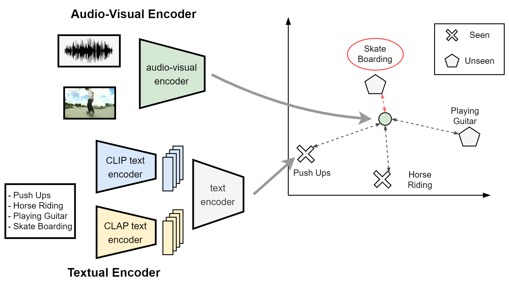

# Audio-Visual Generalized Zero-Shot Learning using Large Pre-Trained Models




## Requirements
Install all required dependencies into a new virtual environment via conda.
```shell
conda env create -f clipclap.yml
conda activate clipclap
```


## Download Features

You can download the CLIP and CLAP features of all three datasets here:
<!-- * [data (CLIP/CLAP)](https://drive.google.com/file/d/1fNb3WvbN76yuPVi4MeVtgDycdX0jAE2G/view?usp=sharing) -->
* [data (CLIP/CLAP)](https://drive.google.com/uc?export=download&id=1fNb3WvbN76yuPVi4MeVtgDycdX0jAE2G)


It does not matter where the features are stored, but the path has to be specified in the --root_dir option when running the training.


```shell
unzip data.zip
```


# Training
In order to train the model run the following command:
```python3 main.py --cfg CFG_FILE  --root_dir ROOT_DIR --log_dir LOG_DIR --dataset_name DATASET_NAME --run all```

```
arguments:
--cfg CFG_FILE is the file containing all the hyperparameters for the experiments. To replicate our results, use ```--cfg config/clipclap.yaml``` for all three datasets.
--root_dir ROOT_DIR indicates the location where the dataset is stored.
--dataset_name {VGGSound, UCF, ActivityNet} indicate the name of the dataset.
--log_dir LOG_DIR indicates where to save the experiments.
--run {'all', 'stage-1', 'stage-2'}. 'all' indicates to run both training stages + evaluation, whereas 'stage-1', 'stage-2' indicates to run only those particular training stages
```
Example commands can be also found in `commands.sh`.

Run training for UCF-GZSL :
```python
nohup python3 main.py --cfg config/clipclap.yaml \
                        --device cuda:6 \
                        --root_dir /path/to/UCF  \
                        --log_dir logs/ClipClap_UCF \
                        --dataset_name UCF \
                        --epochs 20 \
                        --lr 0.00007 \
                        --use_wavcaps_embeddings True \
                        --modality both  \
                        --word_embeddings both   \
                        --run all > logs/ClipClap_UCF.log &
```
Run training for ActivityNet-GZSL :
```python
nohup python3 main.py --cfg config/clipclap.yaml \
                        --device cuda:6 \
                        --root_dir /path/to/ActivityNet  \
                        --log_dir logs/ClipClap_ActivityNet \
                        --dataset_name ActivityNet \
                        --epochs 15 \
                        --lr 0.0001 \
                        --use_wavcaps_embeddings True \
                        --modality both  \
                        --word_embeddings both   \
                        --run all > logs/ClipClap_ActivityNet.log &
```

Run training for VGGSound-GZSL :
```python
nohup python3 main.py --cfg config/clipclap.yaml \
                        --device cuda:5 \
                        --root_dir /path/to/VGGSound  \
                        --log_dir logs/ClipClap_VGGSound \
                        --dataset_name VGGSound \
                        --epochs 15 \
                        --lr 0.0001 \
                        --use_wavcaps_embeddings True \
                        --modality both  \
                        --word_embeddings both   \
                        --run all > logs/ClipClap_VGGSound.log &

```

# Evaluation

Evaluation can be done in two ways. Either you train with ```--run all``` which means that after training the evaluation will be done automatically, or you can do it manually.

For manual evaluation run the following command:

```python3 get_evaluation.py --cfg CFG_FILE --load_path_stage_A PATH_STAGE_A --load_path_stage_B PATH_STAGE_B --dataset_name DATASET_NAME --root_dir ROOT_DIR```

```
arguments:
--cfg CFG_FILE is the file containing all the hyperparameters for the experiments. To replicate our results, use ```--cfg config/clipclap.yaml``` for all three datasets.
--load_path_stage_A will indicate to the path that contains the network for stage 1
--load_path_stage_B will indicate to the path that contains the network for stage 2
--dataset_name {VGGSound, UCF, ActivityNet} will indicate the name of the dataset
--root_dir points to the location where the dataset is stored
```
# Model weights
The trained models can be downloaded from [here](https://drive.google.com/file/d/1H_AwZa5--So5SwHurT5Hq9p1RBo8s3fj/view?usp=sharing).

# Results

### GZSL performance on VGGSound-GZSL, UCF-GZSL, ActivityNet-GZSL

| Method             | VGGSound-GZSL          | UCF-GZSL        | ActivityNet-GZSL |
|--------------------|------------------------|-----------------|------------------|
| CJME               |   7.45                 |    25.87        |   11.64           |
| AVGZSLNET          |   4.71                 |     42.67       |   12.70           |
| AVCA               |   11.26                  |  36.69          |  21.76            |
| Hyper-multiple     |   11.87                  |  41.56          |  20.90            |
| **Proposed**       |  **16.18**              |  **55.97**      |  **27.93**       |


### ZSL performance on VGGSound-GZSL, UCF-GZSL, ActivityNet-GZSL

| Method             | VGGSound-GZSL          | UCF-GZSL        | ActivityNet-GZSL |
|--------------------|------------------------|-----------------|------------------|
| CJME               |    6.84                 |    20.46        |   9.92           |
| AVGZSLNET          |    5.44                 |      35.66       |    12.39           |
| AVCA               |   8.16                  |  38.67          |  20.88            |
| Hyper-multiple     |   8.47                  |  40.28          |  22.18            |
| **Proposed**       |  **11.53**              |  **46.96**      |  **22.76**       |


# Extracting Features from Scratch

Install all required dependencies into a new virtual environment via conda.
```shell
conda env create -f clipclap_feature_extraction.yml
conda activate clipclap_feature_extraction
```

Place the model weights from WavCaps in the following directories:
```
WavCaps/retrieval/pretrained_models/audio_encoders/HTSAT_BERT_zero_shot.pt
WavCaps/retrieval/pretrained_models/audio_encoders/HTSAT.ckpt
```
The files can be downloaded from the [WavCaps repository](https://github.com/XinhaoMei/WavCaps).

In order to extract the CLIP/CLAP features on your own, run the scripts in the ```/clip_feature_extraction``` as follows:
```shell
python3 clip_feature_extraction/get_clip_features_activitynet.py
python3 clip_feature_extraction/get_clip_features_ucf.py
python3 clip_feature_extraction/get_clip_features_vggsound.py
```
Given the files extracted by the above scripts, run the following command to obtain the CLIP/CLAP features:

```shell
python3 splitting_scripts_cls/create_pkl_files_cls.py --dataset_name DATASET_NAME --path_original_dataset PATH_ORIGINAL_DATASET --path_splitted_dataset PATH_SPLITTED_DATASET

arguments:
--dataset_name: Name of the dataset
--path_original_dataset: the path of the dataset where the above scripts (those in ```cls_feature_extraction```) have extracted the dataset
--path_splitted_dataset: the path where to put the dataset after it is processed in the right way.
```


To obtain the class embeddings, run folloing scripts:
```shell
python3 clip_embeddings_extraction/get_clip_embeddings_activitynet.py
python3 clip_embeddings_extraction/get_clip_embeddings_ucf.py
python3 clip_embeddings_extraction/get_clip_embeddings_vggsound.py
```

# Project structure
```src``` - Contains the code used throughout the project for dataloaders/models/training/testing. \
```WavCaps``` - Folder contains the code for the CLAP network. \
```clip_feature_extraction``` - Contains the code used to extract the CLIP/CLAP features from all 3 datasets. \
```clip_embeddings_extraction``` - Contains the code used to extract the CLIP and CLAP class embeddings from all 3 datasets. \
```splitting_scripts_cls``` - Contains files from spltting our dataset into the required structure.
